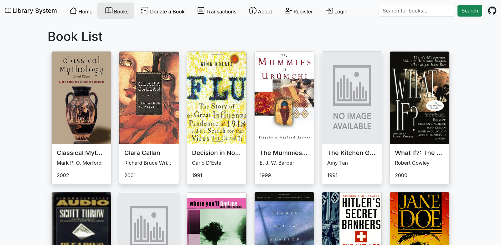
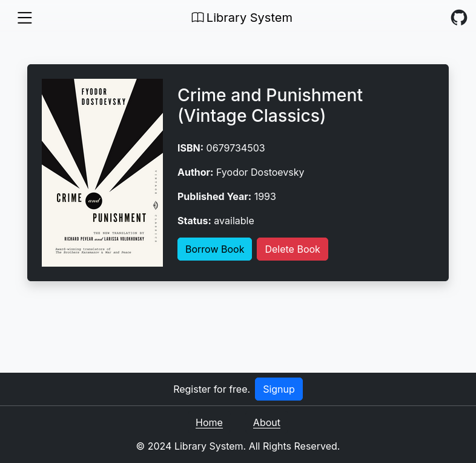

# Library Management System

A Library Management System built with Node.js & Express.

## Resources

- [Node.js](https://nodejs.org/en/docs)
- [Express](http://expressjs.com/en/starter/installing.html)
- [MongoDB](https://www.mongodb.com/docs/)
- [Handlebars](https://handlebarsjs.com/)
- [JWT \(JSON Web Tokens\)](https://jwt.io)
- [Bootstrap](https://getbootstrap.com/docs/5.0)

## Installation

1. Clone the repo.

`git clone https://github.com/theoSire/web422-library-system/`

2. Navigate to the project directory.

`cd web-422-library-system`

3. Install dependencies:
    - Using npm: `npm install`
    - Using bun: `bun install`

4. Start the application:
    - Using npm: `npm start`
    - Using bun: `bun start`

It should be up and running at `http://localhost:3000`.

## Key Features

- **Register/Login**: Create an account to manage transactions and donations.

- **Book Donations**: Donate books with ease--duplicates and missing details handled!

- **Borrow/Return**: Track borrowed books, due dates, and return status.

- **Transaction History**: View your borrowing and returning history on the `/transactions` page.

## API Endpoints

### Books

- `GET /books`: Fetch all books.
- `POST /books/donate`: Donate a book (requires title and author).
- `GET /books/:isbn`: Fetch books details by ISBN.
- `DELETE /books/:isbn`: Delete a book by ISBN.

### Transactions

- `GET /transactions`: Fetch all transactions.
- `POST /transactions/borrow`: Borrow a book (requires user and book ID).
- `POST /transactions/return`: Return a book.

### Authentication

- `POST /login`: User login.
- `POST /register`: User registration.

## Frontend Design

The frontend is built using **Handlebars** templating with **Bootstrap** for styling:

- **Navbar**: Provides easy and quick navigation with links to key pages (Home, Books, Transactions, etc.).
- **Responsive Design**: Ensures compatibility with devices of various sizes.
- **Dynamic Content**: Uses conditional rendering to display different options for logged-in and logged-out users.